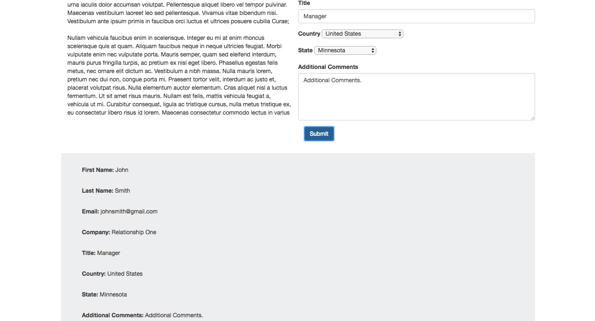
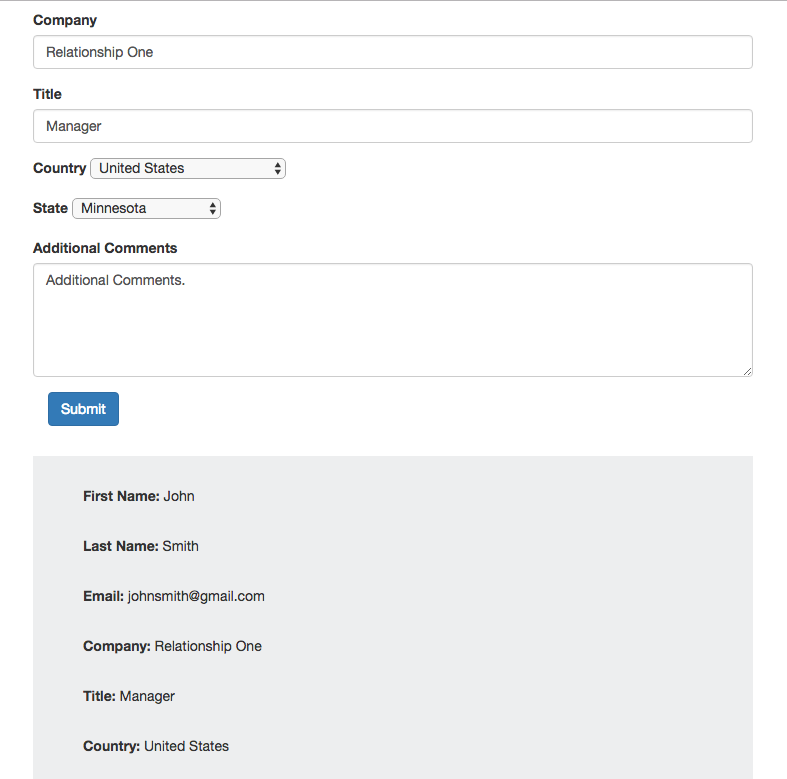

# Home Code Exercise

This repository displays a code exercise which displays a responsive layout, using bootstrap, and collecting form data and displaying it to the DOM.

## The Problem
I was given the instructions to create a responsive website using bootstrap in which the horizontal blocks would stack vertically on smaller screens. I was also given form data and asked to build out the rest of the form and display the data collected upon hitting a submit button, and displaying that information in a bottom div.

## Product Example

Displayed below are three different browser window sizes, which demonstrate how the layout changes responsively to accommodate any screen or device size.

### Large Layout

     

### Medium Layout

     

### Small Layout

     

     

 
## Getting Started 

These instructions will get you a copy of the project up and running on your local machine for development and testing purposes.
1. Download a .zip file of the project
2. Run the command $npm install in terminal
3. Run the command $npm start in terminal to start a server
4. type 'localhost:5000' in browser to view the project
