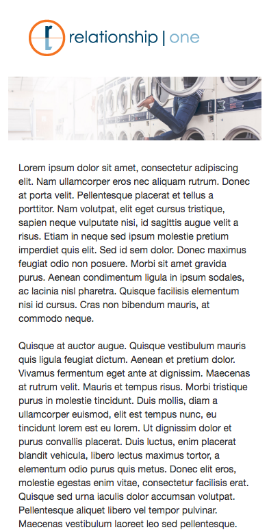
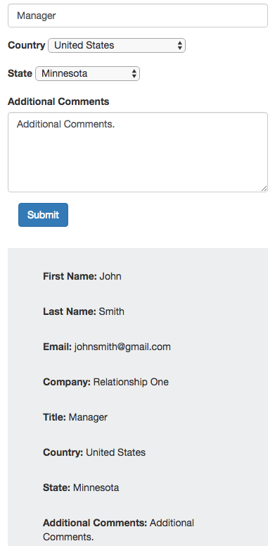
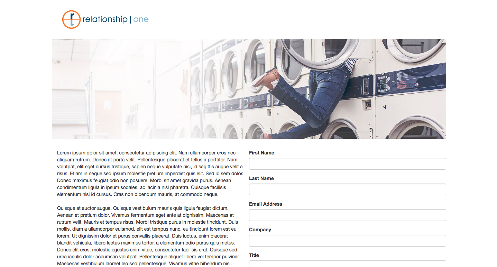

# Home Code Exercise

This repository shows my solution to a code exercise, using bootstrap to create a responsive layout, and using jQuery to collect form data and append it to the DOM

## The Problem
The task was to create a responsive webpage using bootstrap, with items stacking vertically on smaller screens, and some elements sitting inline on larger screens. I was also given form data, asked to build out the rest of the form, and to display the data collected upon hitting a submit button.

## Product Example

Displayed below are three different browser window sizes, which demonstrate how the layout changes responsively to accommodate any screen or device size.

### Small Layout

     

     

### Medium Layout

     

### Large Layout

     

 
## Getting Started 

The project is hosted at https://home-code-exercise.herokuapp.com/ or these instructions will get you a copy of the project up and running on your local machine for development and testing purposes.
1. Download a .zip file of the project
2. Navigate to the directory and run the command 'node server/app.js' in the command line to start a server
3. Type 'localhost:5000' in browser to view the project
